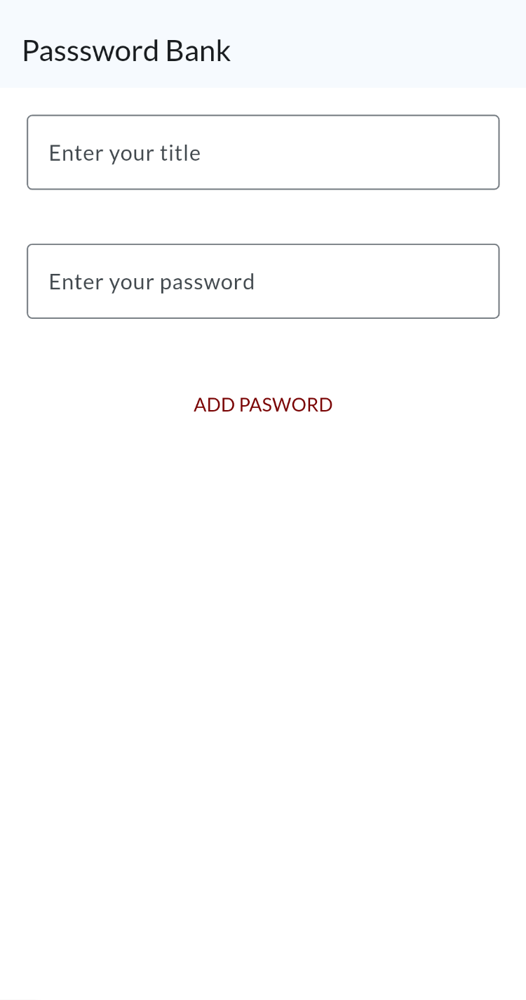
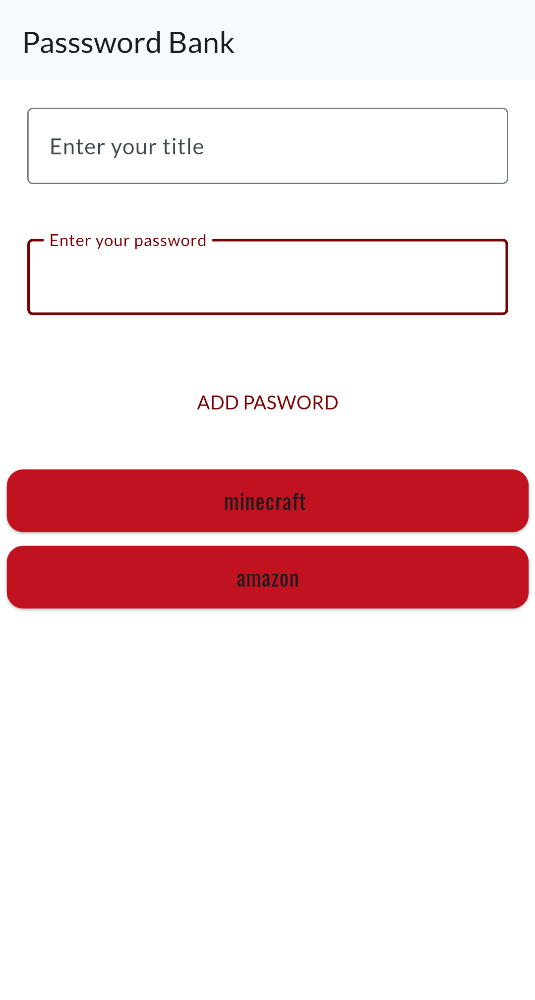
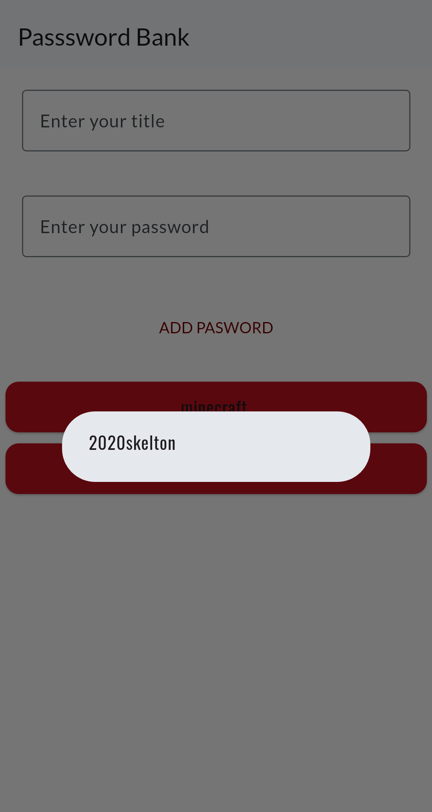

# 🔑 Password Bank

A simple, offline password manager built with Flutter. Store and retrieve your passwords locally on your device — no internet, no accounts, no cloud.

> ⚠️ **Disclaimer:** This app stores passwords in **plaintext** with **no encryption or authentication**. It is intended as a personal utility or learning project and is **not suitable for storing sensitive or critical passwords.**

---

## 📱 Features

- Add passwords with a title and value
- View saved passwords on tap
- Delete passwords with a long press
- Fully offline — data never leaves your device
- Supports light and dark mode
- Clean Material 3 UI with Google Fonts

---

## 🛠️ Built With

- [Flutter](https://flutter.dev/)
- [path_provider](https://pub.dev/packages/path_provider) — local file storage
- [google_fonts](https://pub.dev/packages/google_fonts) — Lato + Oswald typography

---

## 🚀 Getting Started

### Prerequisites
- Flutter SDK installed — [install guide](https://docs.flutter.dev/get-started/install)

### Run the app

```bash
git clone https://github.com/jeromeshaiju/password-bank.git
cd password-bank
flutter pub get
flutter run
```

---

## 📂 How Data is Stored

Passwords are saved locally as a JSON file at:

```
<App Documents Directory>/passwords/password.json
```

The data is stored in **plaintext JSON** — there is no encryption. Anyone with access to the device's file system can read the stored passwords.

---

## 🔮 Planned Improvements

- [ ] Master PIN to lock the app
- [ ] AES encryption for stored passwords
- [ ] Copy to clipboard on tap
- [ ] Search/filter passwords
- [ ] Edit existing passwords

---

## 👨‍💻 Author

**Jerome Shaiju**  
[github.com/jeromeshaiju](https://github.com/jeromeshaiju)

---

## 📸 Screenshots

<p float="left">
  
  
  
  
</p>


---

## 📄 License

This project is open source and available under the [MIT License](LICENSE).
